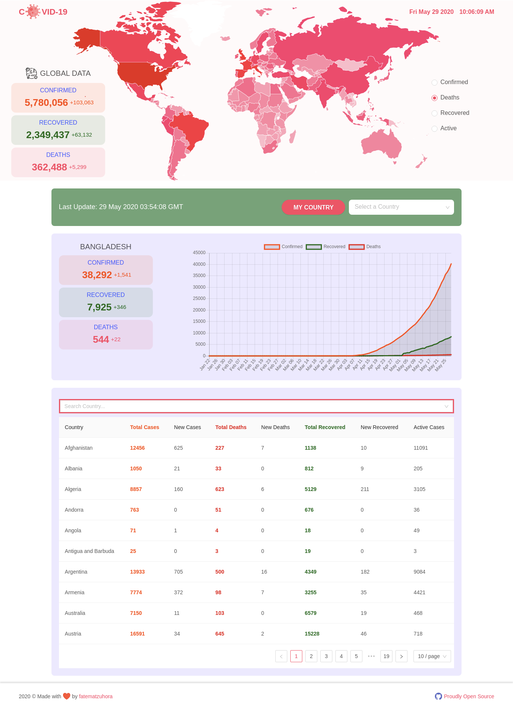

# [covid19 Tracker]()
An interactive web app to visualize and track Novel Coronavirus (COVID-19) data, made with React & Redux.

[](https://github.com/facebook/react)
[](https://github.com/fatematzuhora/covid19.git)

Data is sourced from [Johns Hopkins CSSE](https://github.com/CSSEGISandData/COVID-19)

API is built by [covid19api.com](https://covid19api.com/)


### Live URL
`covid19 Tracker` app is running as a website hosted on

👉 [https://]()


### Screenshot



### Quick Start
* Clone the repo:
```
git clone https://github.com/fatematzuhora/covid19.git
```
* Go inside the folder:
```
cd covid19
```
* Install necessary libraries:
```
npm i
```
* Build CSS from SASS:
```
npm run build:css
```
* Run Project:
```
npm start
```


### Disclaimer
This simple web app massages and displays based on curated datasets from `Johns Hopkins CSSE` and does not attempt to produce or collect any beyond those sources. The datasets come with their own sets of "Terms and Conditions".